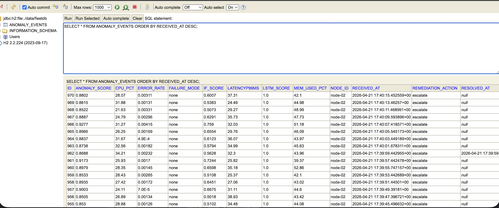
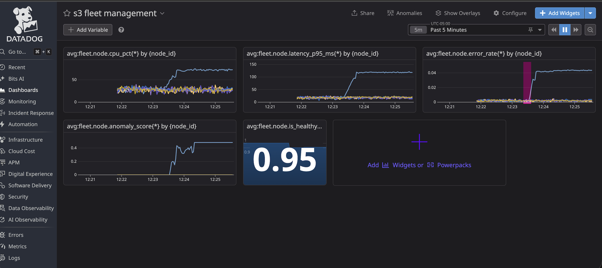

# Self-Healing Distributed System


**Live Dashboard:** [Datadog →](https://p.us5.datadoghq.com/sb/c449c658-6d81-11f0-8200-e2a5306dcc23-f185803d51eee3fc751a77cbdca26164)  
**Control Plane API:** `http://localhost:8080/api/status`

---

## Demo





The dashboard shows a cascading failure being detected and remediated in real time:
- CPU spike on one node while others stay flat
- Latency climbing from 10ms to 150ms
- Error rate spiking — ML model detects it within 5 seconds
- Anomaly score crossing threshold → control plane fires `reroute_traffic`
- Metrics recovering after remediation

---

## What it does

- Simulates a fleet of 6 host nodes emitting 14 real-time metrics every 2 seconds
- Injects realistic failures: CPU spikes, memory leaks, cascading failures, disk saturation, network flaps, silent death
- Detects anomalies using two ML models in parallel — Isolation Forest for point anomalies, LSTM Autoencoder for sequence anomalies
- Automatically decides and applies remediations: reroute traffic, restart process, isolate node, or escalate
- Ships all metrics and anomaly events to Datadog in real time
- Persists every decision to a database — recoverable if the control plane crashes

**In testing: 22,000+ metrics processed · 6,000+ anomalies detected · 0 dropped**

---

## Architecture

```
Host nodes (Python)
    ↓ 14 metrics every 2s
Telemetry pipeline + feature engineering
    ↓                          → Datadog (15 metrics per node, live)
ML anomaly detection
    ├── Isolation Forest        (point anomalies — fast)
    └── LSTM Autoencoder        (sequence anomalies — catches gradual drift)
    ↓ combined score           → Datadog Events (anomaly annotations)
Java control plane (Spring Boot)
    ├── Decision engine         (9-rule priority system)
    ├── Remediation service     (rate-limited, circuit-breaker)
    └── PostgreSQL persistence  (crash-safe audit trail)
```

---

## Tech stack

| Layer | Technology |
|---|---|
| Host simulation | Python 3.13, threading |
| Feature engineering | Rolling stats, lag features, rate-of-change |
| Anomaly detection | scikit-learn (Isolation Forest), PyTorch (LSTM Autoencoder) |
| Control plane | Java 17, Spring Boot 3, Spring Data JPA |
| Database | H2 (dev), PostgreSQL (prod) |
| Observability | Datadog — metrics, events, live dashboard |
| Infrastructure | AWS EC2, Docker |

---

## Quickstart

### 1. Clone and install

```bash
git clone https://github.com/Revanth14/self-healing-distributed-sys.git
cd self-healing-distributed-sys
uv add scikit-learn torch numpy pandas datadog python-dotenv requests
```

### 2. Configure Datadog

```bash
cp .env.example .env
# Add your Datadog API key, app key, and site
```

### 3. Train ML models

Collects 3 minutes of healthy baseline data then trains both models:

```bash
uv run python3 -m ml.train
```

### 4. Start the Java control plane

```bash
cd control-plane
mvn spring-boot:run
```

### 5. Run the system

```bash
# Normal mode
uv run python3 main.py

# Chaos mode — inject random failures every 60s
uv run python3 main.py --chaos

# Targeted chaos
uv run python3 main.py --chaos --node node-02 --mode cascading --interval 90
```

---

## How the ML detection works

A single metric reading tells you almost nothing. The dual-model approach detects what neither model could alone:

**Isolation Forest** — trained on healthy baseline feature vectors. Scores each snapshot against the healthy distribution. Fast, catches sudden point anomalies immediately.

**LSTM Autoencoder** — trained to reconstruct sequences of 15 snapshots (30 seconds of history). High reconstruction error = the sequence doesn't look like healthy data. Catches gradual drift and cascading failures that develop over time.

**Combined score** = 0.3 × IF + 0.7 × LSTM. Threshold at 0.65.

A cascading failure develops like this:

```
T+0s:  CPU starts climbing      → IF detects it immediately
T+15s: Latency follows          → LSTM window filling
T+25s: Errors spike             → combined score crosses 0.65
T+26s: ANOMALY DETECTED         → control plane notified
T+27s: reroute_traffic fired    → users protected
T+60s: restart_process fired    → node recovering
```

A simple threshold on CPU alone would miss this entirely until errors spike.

---

## Decision engine

The Java control plane maps anomaly signals to actions using a 9-rule priority system:

| Priority | Condition | Action |
|---|---|---|
| 1 | Silent death | Isolate node |
| 2 | Error rate > 10% | Restart process |
| 3 | Cascading failure | Reroute traffic |
| 4 | CPU > 85% | Reroute traffic |
| 5 | Memory leak + mem > 90% | Restart process |
| 6 | Latency p99 > 300ms | Reroute traffic |
| 7 | Disk saturation | Escalate to human |
| 8 | High combined score | Restart process |
| 9 | ≥ 3 prior remediations | Escalate to human |

Circuit breaker: max 2 remediations per node per minute.

---

## Control plane API

```bash
GET  /api/health              # health check
GET  /api/status              # fleet summary
POST /api/anomaly             # receive anomaly from ML layer
GET  /api/events              # last 50 remediation events
GET  /api/events/{nodeId}     # events for a specific node
```

```bash
curl http://localhost:8080/api/status
# {"applied":4,"total_events":25,"control_plane":"healthy"}

curl http://localhost:8080/api/events/node-03 | python3 -m json.tool
```

---

## Failure modes

| Mode | What it simulates |
|---|---|
| `cascading` | CPU → latency → errors in sequence |
| `cpu_spike` | CPU saturates, latency climbs |
| `memory_leak` | Memory grows until OOM |
| `latency_blowout` | Latency spikes, errors follow |
| `disk_saturation` | Disk I/O maxes out |
| `network_flap` | Intermittent packet loss |
| `silent_death` | Node stops emitting entirely |

All failures ramp up gradually with Gaussian noise — not instant clean spikes. Critical for the LSTM to learn temporal degradation patterns.

---


## What this maps to at S3 scale

| This project | S3 Fleet Management |
|---|---|
| 6 simulated nodes (threads) | Hundreds of thousands of physical hosts |
| Python metrics queue | Apache Kafka |
| H2 / PostgreSQL | Amazon DynamoDB |
| Local ML models | Amazon SageMaker |
| Datadog | Internal AWS observability |
| Manual chaos injection | Real hardware failures |

---
